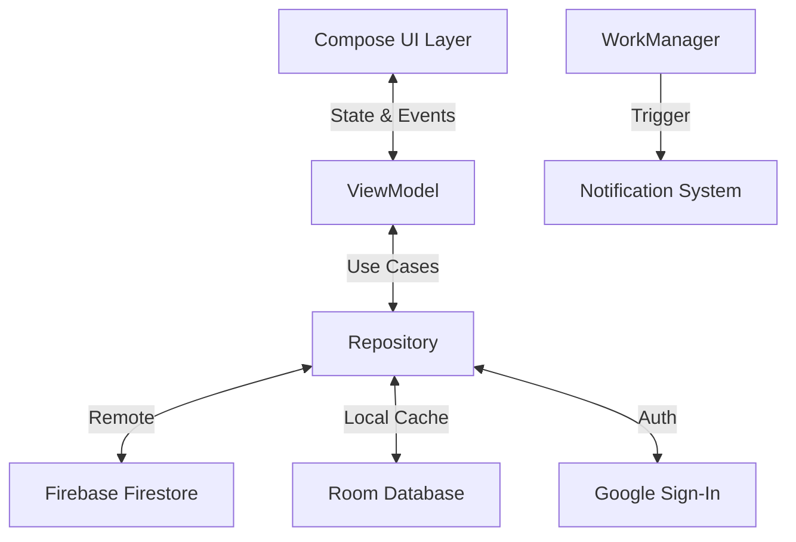

<div align="center">

# 🔥 CodeStreak
### Build the Habit. Break the Loop.


<br />

<a href="https://github.com/SilentFURY-x/CodeStreak-Daily-Coding-App/releases/download/v1.0.0/CodeStreak-v1.0.0.apk">
  
</a>

<br /> <br />

<p align="center">
  <a href="#-key-features">Features</a> •
  <a href="#-screenshots">Screenshots</a> •
  <a href="#tech-stack">Tech Stack</a> •
  <a href="#architecture">Architecture</a> •
  <a href="#setup">Setup</a>
</p>

</div>

---

## 🚀 About The Project

**CodeStreak** is not just another coding app; it is a discipline builder. Designed for developers who struggle with consistency, CodeStreak delivers **exactly one** high-quality coding problem every day at 9:00 AM.

Unlike massive platforms that overwhelm you with thousands of choices, CodeStreak focuses on the **habit**. It features a distraction-free environment, offline capability, and a "sassy" notification system that guilt-trips you into coding.

> **"Consistency eats talent for breakfast."** — CodeStreak helps you win the morning.

---

## ✨ Key Features

### 📅 The Daily Drop
* **Curated Challenge:** A fresh algorithmic problem unlocks every day at **9:00 AM**.
* **24-Hour Cycle:** Solve it before the clock resets to keep your streak alive.
* **Smart Difficulty:** Questions range from Easy to Hard, covering Arrays, Trees, DP, and more.

### 💻 The Arena (Workspace)
* **Syntax Highlighting:** A beautiful, dark-themed code editor built for mobile.
* **Deferred Rendering:** Optimized performance ensuring butter-smooth transitions even on heavy loads.
* **No Peeking:** Solutions are locked until you submit a valid attempt.

### 🏆 Gamification & Profile
* **Heatmap Visualization:** Track your consistency with a GitHub-style contribution graph.
* **Streak Counter:** Don't break the chain! Visual cues change based on your streak length.
* **Badges:** Earn achievements for milestones (e.g., "7-Day Streak", "Graph Master").

### ⚡ Utility & Polish
* **Offline-First:** Built with **Room Database**, allowing you to view bookmarks and past solutions without internet.
* **Sassy Notifications:** A background worker (`WorkManager`) that sends randomized, motivational (and slightly aggressive) reminders if you haven't coded by noon.
* **Smooth Animations:** Custom navigation transitions that mimic native iOS/Android system gestures.

---

## 📸 Screenshots

<div align="center">

| **Home Dashboard** | **The Workspace** | **Profile & Heatmap** | **Dark Mode Editor** |
|:---:|:---:|:---:|:---:|
|  |  |  |  |

</div>

---

<a id="tech-stack"></a>
## 🛠️ Tech Stack

Engineered with Modern Android Development (MAD) standards.

| Layer | Component | Technology Used |
| :--- | :--- | :--- |
| **🎨 UI** | **Design System** | Jetpack Compose (Material 3) |
| | **Animations** | `androidx.compose.animation` (AnimatedContent, Shimmer) |
| | **Navigation** | State-based Navigation with Smart Transitions |
| **🧠 Logic** | **Architecture** | MVVM + Clean Architecture |
| | **DI** | Dagger Hilt |
| | **Concurrency** | Coroutines & Kotlin Flows |
| **💾 Data** | **Local DB** | Room (Offline Caching) |
| | **Remote** | Firebase Firestore (Real-time Sync) |
| | **Auth** | Firebase Auth (Google Sign-In) |
| **⚙️ System** | **Background** | WorkManager (Periodic Notifications) |
| | **Permissions** | Android 13+ Notification & Battery Optimization Logic |

---

<a id="architecture"></a>
## 🏗️ Architecture

CodeStreak follows a strict **Unidirectional Data Flow (UDF)** to ensure stability and testability.


---

## Directory Structure

```text
com.fury.codestreak
├── data                        # Data Layer (Single Source of Truth)
│   ├── local                   # Room Database (Offline Cache)
│   │   ├── AppDatabase
│   │   ├── QuestionDao
│   │   └── QuestionEntity.kt
│   ├── remote                  # Network Data Source
│   │   └── CodeforcesApi
│   ├── model                   # Data Transfer Objects (DTOs)
│   │   └── CodeforcesModels.kt
│   └── repository              # Repository Implementations
│       ├── AuthRepositoryImpl
│       ├── QuestionRepositoryImpl
│       └── UserRepositoryImpl
├── di                          # Dependency Injection
│   └── AppModule               # Hilt Module (Provides Singletons)
├── domain                      # Domain Layer (Pure Business Logic)
│   ├── model                   # Core App Models
│   │   ├── Question
│   │   └── User
│   └── repository              # Repository Interfaces
│       ├── AuthRepository
│       ├── QuestionRepository
│       └── UserRepository
├── presentation                # UI Layer (Jetpack Compose + MVVM)
│   ├── auth                    # Authentication
│   │   ├── AuthScreen.kt
│   │   └── AuthViewModel.kt
│   ├── home                    # Dashboard & Daily Logic
│   │   ├── HomeScreen.kt
│   │   └── HomeViewModel.kt
│   ├── workspace               # Code Editor & Submission
│   │   ├── CodeEditor.kt
│   │   ├── WorkspaceScreen.kt
│   │   └── WorkspaceViewModel
│   ├── profile                 # User Stats & Heatmap
│   │   ├── ProfileScreen.kt
│   │   └── ProfileViewModel.kt
│   ├── solution                # Solution Reveal Logic
│   │   ├── SolutionScreen.kt
│   │   └── SolutionViewModel
│   ├── bookmarks               # Saved Questions
│   │   ├── BookmarksScreen.kt
│   │   └── BookmarksViewModel.kt
│   ├── components              # Reusable UI Components
│   │   └── Shimmer.kt
│   └── theme                   # Material 3 Design System
│       ├── Color.kt
│       ├── Theme.kt
│       └── Type.kt
└── util                        # Utilities & Background Tasks
    ├── NotificationWorker      # WorkManager for Daily Alerts
    ├── Resource                # Sealed Class for Data State
    ├── CodeStreakApp           # Application Entry Point
    └── MainActivity            # Single Activity Architecture
```

---

<a id="setup"></a>
## ⚡ Setup & Installation
**Download the App:**
* Click below to download the latest stable version (v1.0.0) for your Android device:
* 👉 **[Download CodeStreak-v1.0.0.apk](https://github.com/SilentFURY-x/CodeStreak-Daily-Coding-App/releases/download/v1.0.0/CodeStreak-v1.0.0.apk)**

**OR**

1.  **Clone the repository:**
    ```bash
        git clone https://github.com/SilentFURY-x/CodeStreak-Daily-Coding-App.git
    ```
2.  **Add Firebase**
    * Create a project on Firebase Console.
    * Download google-services.json and place it in the app/ directory.

3.  **Build & Run:**
    * Open in Android Studio (Koala or newer).
    * Sync Gradle and Run on Emulator/Device.

---

## 🤝 Contributing

Contributions are what make the open-source community such an amazing place to learn, inspire, and create. Any contributions you make are **greatly appreciated**.
1.  **Fork the Project**
2.  **Create your Feature Branch:**

      ```bash
      git checkout -b feature/AmazingFeature
      ```
4.  **Commit your Changes:**

      ```bash
      git commit -m 'Add some AmazingFeature'
      ```
6.  **Push to the Branch:**
      ```bash
      git push origin feature/AmazingFeature
      ```
7.  **Open a Pull Request**

---

## 📄 License

Distributed under the MIT License. See `LICENSE` for more information.

---

## 👨‍💻 Author
<div align="center">

**Arjun Tyagi**

[](https://github.com/SilentFURY-x)
[](https://www.linkedin.com/in/arjun-tyagi-84b1b5328/)

</div>

---

<p align="center">
  🔥<i> Don't break the chain.</i>
</p>
